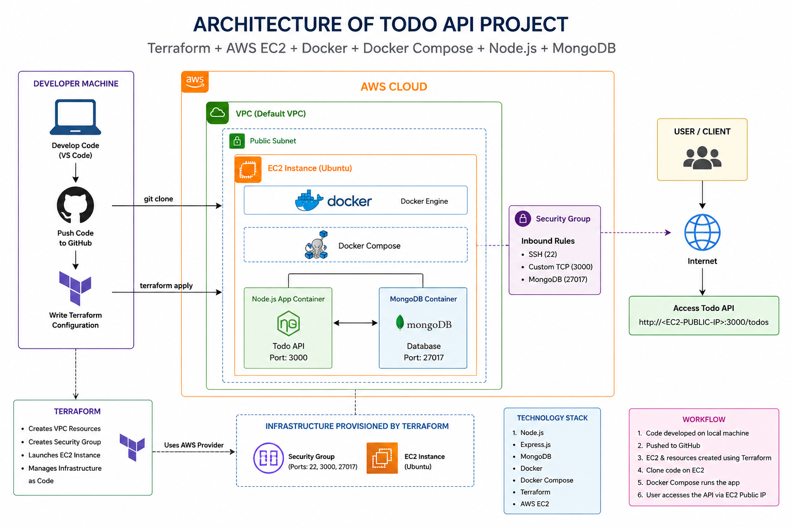
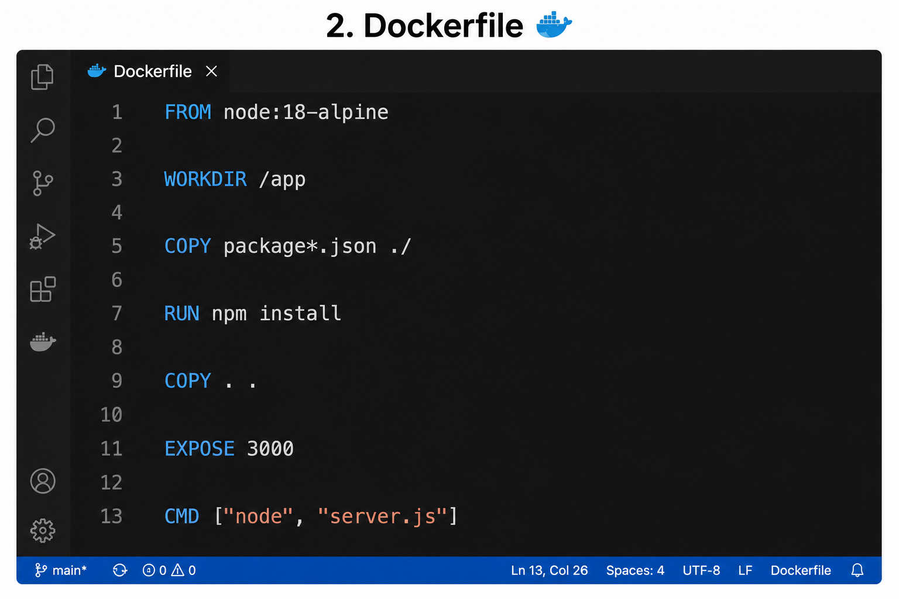

# Todo API

A simple Todo REST API built with Node.js, Express, and MongoDB.

## Architecture



This project follows a small but clear backend architecture with Terraform provisioning an AWS EC2 host that runs Docker Compose.

- `server.js` - Entry point that starts the Express server, connects to MongoDB, and mounts routes.
- `config/db.js` - Database connection helper for MongoDB using Mongoose.
- `models/Todo.js` - Mongoose schema/model for Todo items.
- `routes/todoRoutes.js` - REST API endpoints for creating, reading, updating, and deleting todos.

### Component overview

- Express middleware enables JSON parsing and route handling.
- Mongoose maps the Todo model to MongoDB documents.
- The API exposes CRUD endpoints under `/todos`.
- Docker Compose can run the app and MongoDB together for local development.
- Terraform files in `terraform/` are intended for provisioning infrastructure such as EC2, VPC, and security group resources.

## Image Sequence

1. Architecture diagram

   

2. Terraform apply

   

3. Dockerfile reference

   

4. Docker Compose setup

   

5. Docker container running

   

6. EC2 instance view

   

7. Project structure overview

   

8. API response example

   

## Tech Stack

- Node.js
- Express
- MongoDB
- Mongoose
- Docker / Docker Compose
- Terraform (in `terraform/`) for infrastructure-related provisioning

## API Endpoints

| Method | Endpoint | Description |
|---|---|---|
| GET | `/todos` | Get all todos |
| POST | `/todos` | Create a new todo |
| GET | `/todos/:id` | Get a single todo by ID |
| PUT | `/todos/:id` | Update a todo by ID |
| DELETE | `/todos/:id` | Delete a todo by ID |

### Example payload

POST `/todos`

```json
{
  "title": "Buy groceries"
}
```

## Local Setup

1. Install dependencies:

```bash
npm install
```

2. Create a `.env` file in the project root with a MongoDB connection string:

```env
MONGO_URI=mongodb://localhost:27017/todos
```

3. Run the app:

```bash
npm run start
```

4. For development with auto-reload:

```bash
npm run dev
```

## Docker (recommended for local development)

Run the project with Docker Compose:

```bash
docker compose up --build
```

This starts:

- `app` on port `3000`
- `mongo` on port `27017`

## Project Structure

```
├── config
│   └── db.js
├── models
│   └── Todo.js
├── routes
│   └── todoRoutes.js
├── terraform
│   └── ...infra files...
├── Dockerfile
├── docker-compose.yml
├── package.json
└── server.js
```

## Notes

- `server.js` currently uses `process.env.MONGO_URI` for the database connection.
- The app listens on port `3000` by default.
- Terraform files live in `terraform/` for infrastructure deployment, but the API itself is configured through Express and Docker Compose.
